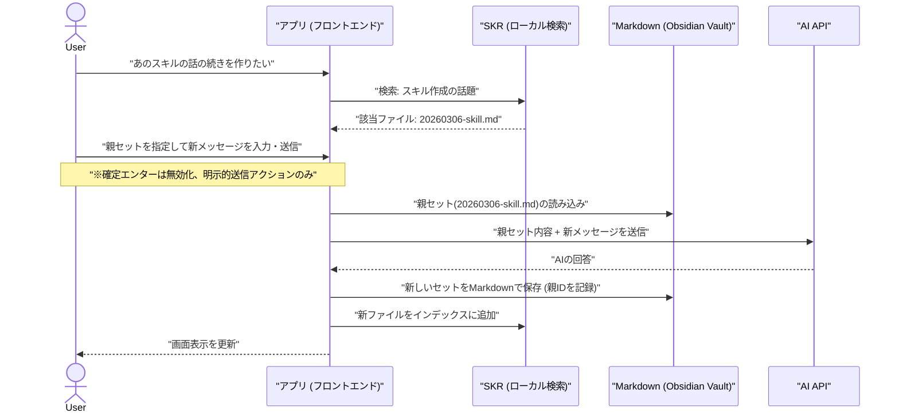

# Obsidian連動型 ノードベースAIチャットエンジン コンセプト

## 1. ビジョン

**「対話を資産に変え、思考の軌跡をファイルとして手元に残す」**

タイムラインに流れて消えるチャットではなく、1回のやり取り（セット）を独立したMarkdownファイルとして永続化します。ユーザーは常に「直近の明確な意図」のみをAIに渡し、過去の知見はSKRによる検索とObsidianによるネットワーク管理で引き出します。トークン浪費ゼロ、誤送信ゼロの、あなた専用のナレッジ構築チャットアプリです。

## 2. コア・アーキテクチャ

### ① 1セット = 1 Markdownファイル

ユーザーの送信メッセージとAIの返信は、必ず1つのMarkdownファイルとして保存されます。

* **Frontmatter (YAML):** セットID、親セットID、作成日時、タグなどを記録。
* **Body:** ユーザーのプロンプトと、AIの回答を記述。
* これにより、Obsidian等のローカルツールでグラフビューとして可視化・編集が可能になります。

### ② 明示的なコンテキスト・リンク（数珠繋ぎ）

AIには**「今回送信するメッセージ」と「明示的に指定した親セット（Markdownの内容）」のみ**を送信します。

* 過去の履歴を自動でダラダラと送ることは一切しません。
* 「あの件の続き」を話したい時は、SKRで過去のMarkdownを検索し、そのIDを「親」として指定するだけです。

### ③ SKR（セマンティック・ナレッジ・リポジトリ）の役割

ローカルのMarkdownファイル群を常にインデックス化し、ユーザーからの「あの設定どこだっけ？」という検索要求に対して、該当のファイルパス（またはID）を即座に返す、純粋な「検索エンジン」として機能します。

## 3. システムフロー図

## 4. 確信度と技術的評価

### 確信度：極めて高い（95%以上）

* **理由:** 複雑なRAG（検索拡張生成）の自律的なプロンプト構築ロジックを捨て、**「ユーザーが明示的に親ノードを指定する」**という仕様に振り切ったため、AIのハルシネーション（幻覚）リスクが劇的に低下しました。
* また、データストアを独自のデータベースではなく「ローカルのMarkdownファイル」としたことで、データのポータビリティが確保され、開発難易度も下がり、システムの堅牢性が跳ね上がっています。

### 不確実な要素：ほぼ無し（実装上の工夫のみ）

* 強いて言えば、ユーザーが「過去のどこに情報があるかAIに探してほしい」と要求した際の処理です。これは通常のチャットモードとは別に、**「SKR検索用コマンド（例: `/search [クエリ]`）」**を用意し、アプリ側がSKRに問い合わせて結果のリストを画面に返すだけの仕組みにすれば、AIのトークンを一切消費せずに解決します。
