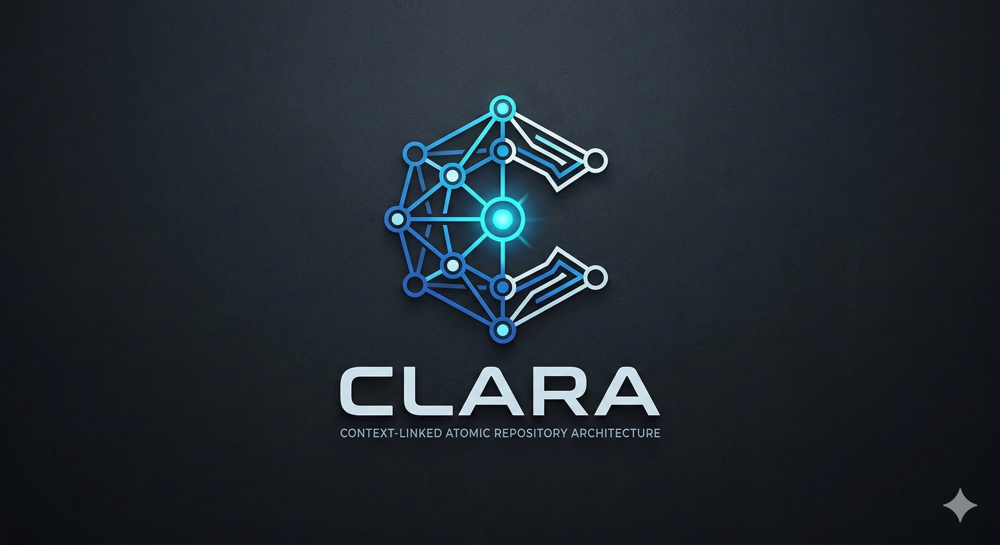
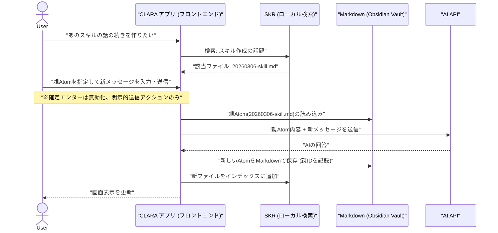

  

# CLARA

**Context-Linked Atomic Repository Architecture**

「対話を資産に変え、思考の軌跡をファイルとして手元に残す」

**CLARA（クララ）** は、タイムラインに流れて消えるチャットではなく、1回のやり取り（Atom）を独立したMarkdownファイルとして永続化する、Obsidian連動型のノードベースAIチャットエンジンです。

ユーザーは常に「直近の明確な意図」のみをAIに渡し、過去の知見はローカル検索とObsidianによるネットワーク管理で引き出します。トークン浪費ゼロ、誤送信ゼロの、あなた専用の開発者向けナレッジ構築環境を提供します。

---

## � 用語定義 (Terminology)

* **Atom (アトム)**: CLARAにおける「1回のやり取り（ユーザーの送信とAIの返信）」の単位。独立した1つのMarkdownファイルとして保存されます。
* **Vault (ボールト)**: Atom（Markdownファイル群）が保存・蓄積されるローカルの保管場所。
* **YOLOモード**: 確認ステップをスキップして即座に実行等を行うモード。※**ご利用は計画的に。**

---

## �🚀 コア・アーキテクチャ

### 1. 1Atom = 1 Markdownファイル

ユーザーの送信メッセージとAIの返信は、必ず1つのMarkdownファイルとして保存されます。

* **Frontmatter (YAML):** Atom ID、親Atom ID、作成日時、タグなどを記録。
* **Body:** ユーザーのプロンプトと、AIの回答を記述。
* これにより、Obsidian等のローカルツールでグラフビューとして可視化・編集が可能になります。

### 2. 明示的なコンテキスト・リンク（数珠繋ぎ）

AIには **「今回送信するメッセージ」と「明示的に指定した親Atom（Markdownの内容）」のみ** を送信します。

* 過去の履歴を自動でダラダラと送ることは一切しません。
* 「あの件の続き」を話したい時は、SKRで過去のMarkdownを検索し、そのIDを「親」として指定するだけです。

### 3. SKR（セマンティック・ナレッジ・リポジトリ）の役割（※開発中）

ローカルのMarkdownファイル群を常にインデックス化し、ユーザーからの「あの設定どこだっけ？」という検索要求に対して、該当のファイルパス（またはID）を即座に返す、純粋な「検索エンジン」として機能させる予定です（現在、順次実装中）。

---

## 🔄 システムフロー

